# ModelScope 开源大语言模型部署与横向对比

姓名：蒋昊沄  
学号：2450333  
课程：人工智能导论  
实验报告：[report/实验报告.md](report/实验报告.md)
GitHub 项目链接：[https://github.com/JambitX11/LLM-Deployment-and-Comparison](https://github.com/JambitX11/LLM-Deployment-and-Comparison)


本仓库用于完成《人工智能导论》第三次作业：在 ModelScope/魔搭平台上部署并测试开源大语言模型，并对不同模型在中文问答任务中的表现进行横向比较。本实验测试了 Qwen-7B-Chat、ChatGLM3-6B 和 Baichuan2-7B-Chat 三个模型，重点观察它们在中文表达、语义歧义理解、多层逻辑推理、指代关系理解和一词多义理解方面的差异。

本仓库不保存模型权重文件。模型权重在云平台下载到 `/mnt/data/`，GitHub 仓库仅保存代码、测试问题、运行输出、截图和实验报告。

仓库结构如下

```text
LLM-Deployment-and-Comparison/
├── README.md
├── requirements.txt
├── scripts/
│   ├── install_deps_cpu.sh
│   ├── download_models.sh
│   ├── run_questions_cpu.py
│   ├── run_qwen_cpu.py
│   ├── run_chatglm3_cpu.py
│   └── run_baichuan_cpu.py
├── prompts/
│   ├── test_questions.md
│   └── test_questions.json
├── results/
│   ├── raw_outputs/
│   ├── qwen_results.md
│   ├── chatglm3_results.md
│   ├── baichuan_results.md
│   └── comparison_table.md
├── screenshots/
└── report/
    └── 实验报告.md
```

## 1. 实验目的

本实验的主要目标是熟悉开源大语言模型在 ModelScope 云端 Notebook 中的部署流程，并通过统一测试问题比较多个模型的实际问答效果。

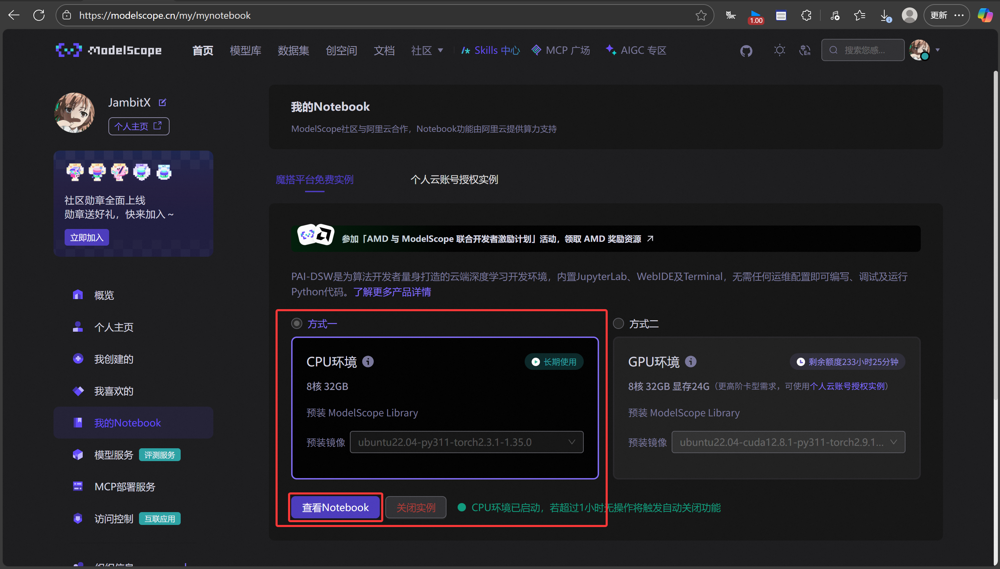


## 2. 实验环境

实验平台为 ModelScope/魔搭 CPU Notebook。代码目录为 `/mnt/workspace/LLM-Deployment-and-Comparison`，模型目录为 `/mnt/data/`。由于云平台磁盘空间有限，实验没有同时保存三个模型，而是采用“下载一个模型、测试一个模型、保存结果和截图、删除后再下载下一个模型”的方式完成。


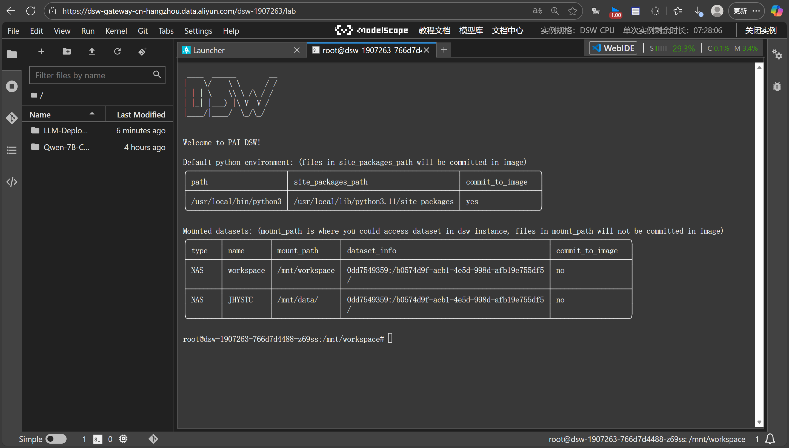

项目通过 GitHub 克隆到云平台后运行，依赖安装通过 `scripts/install_deps_cpu.sh` 完成。实验过程中曾遇到 Qwen 依赖兼容问题，最终固定了 `transformers==4.33.3` 和 `transformers_stream_generator==0.0.4`，保证 Qwen 的远程模型代码能够正常加载。

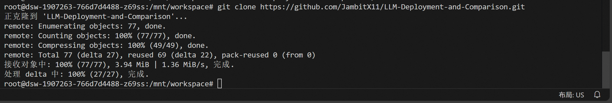

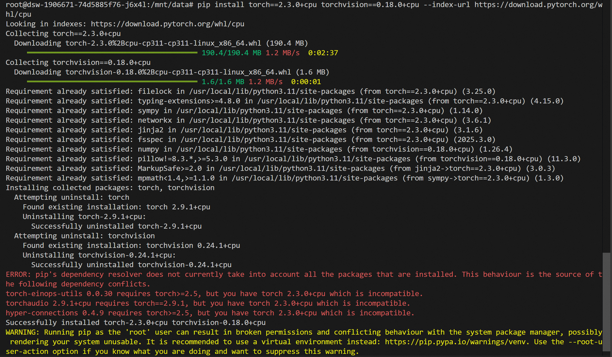

## 3. 测试模型

本实验选择三个中文开源对话模型。它们参数规模接近，均可在 ModelScope 平台下载并通过 `transformers` 的 `trust_remote_code=True` 加载。

| 模型 | 模型目录 | 原始输出 |
| --- | --- | --- |
| Qwen-7B-Chat | `/mnt/data/Qwen-7B-Chat` | [qwen_all_questions.md](results/raw_outputs/qwen_all_questions.md) |
| ChatGLM3-6B | `/mnt/data/chatglm3-6b` | [chatglm3_all_questions.md](results/raw_outputs/chatglm3_all_questions.md) |
| Baichuan2-7B-Chat | `/mnt/data/Baichuan2-7B-Chat` | [baichuan_all_questions.md](results/raw_outputs/baichuan_all_questions.md) |

模型下载过程如下。

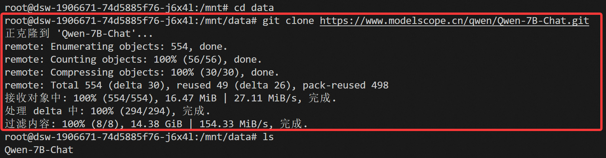

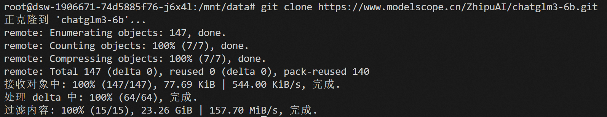

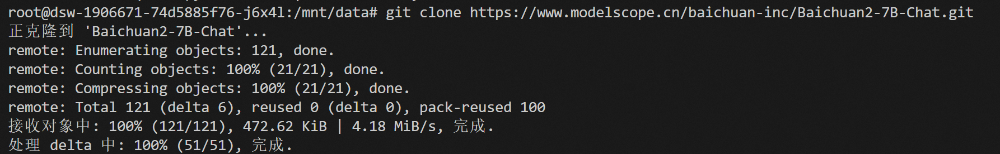

## 4. 测试方法

测试问题保存在 [prompts/test_questions.json](prompts/test_questions.json)，说明版保存在 [prompts/test_questions.md](prompts/test_questions.md)。五个问题分别考察不同能力：季节语境与反讽、中文双关歧义、多层逻辑推理、断句与指代关系、一词多义与语境理解。

为了避免 CPU 环境中重复加载模型造成额外耗时，实验使用 [scripts/run_questions_cpu.py](scripts/run_questions_cpu.py) 进行批量推理。脚本每次只加载一个模型，然后按顺序回答 5 个问题，并将模型输出、模型加载耗时、每题生成耗时和总耗时保存到 `results/raw_outputs/`。

主要运行命令如下：

```bash
python scripts/run_questions_cpu.py --model qwen --max_new_tokens 256 --dtype auto --num_threads 4
python scripts/run_questions_cpu.py --model chatglm3 --max_new_tokens 300 --dtype auto --num_threads 8
python scripts/run_questions_cpu.py --model baichuan --max_new_tokens 256 --dtype auto --num_threads 4
```

## 5. 运行结果

从运行耗时看，三个模型差异明显。Qwen 加载和生成都比较稳定，Baichuan 加载较慢但生成速度较快，ChatGLM3 虽然加载最快，但生成阶段耗时远高于另外两个模型。

| 模型 | 模型加载耗时 | 5 题生成总耗时 | 运行总耗时 |
| --- | --- | --- | --- |
| Qwen-7B-Chat | 3.37 秒 | 192.79 秒 | 196.16 秒 |
| ChatGLM3-6B | 0.86 秒 | 3853.97 秒 | 3854.83 秒 |
| Baichuan2-7B-Chat | 100.20 秒 | 200.43 秒 | 300.63 秒 |

### 5.1 Qwen-7B-Chat

Qwen-7B-Chat 的模型加载耗时为 3.37 秒，5 个问题生成总耗时为 192.79 秒，运行总耗时为 196.16 秒。从耗时看，Qwen 在本次 CPU 环境下运行相对顺利，五个问题中耗时最长的是“一词多义”问题，生成耗时为 64.92 秒。

| 问题 | 生成耗时 | 回答表现概述 |
| --- | --- | --- |
| 问题 1 | 45.43 秒 | 能识别冬天应多穿，但对夏天解释为“多穿防晒和保持凉爽”，没有准确说出夏天语境中“能穿多少穿多少”常指尽量少穿。 |
| 问题 2 | 27.53 秒 | 没有准确抓住两个“谁都看不上”分别表示“自己看不上别人”和“别人看不上自己”的幽默歧义。 |
| 问题 3 | 35.27 秒 | 对多层“知道/不知道”关系解释混乱，没有给出稳定明确的逻辑结论。 |
| 问题 4 | 19.64 秒 | 没能完成断句和指代解析，回答为上下文不足。 |
| 问题 5 | 64.92 秒 | 对“意思”的多义解释较完整，能区分意图、敷衍、够朋友和小事等含义。 |

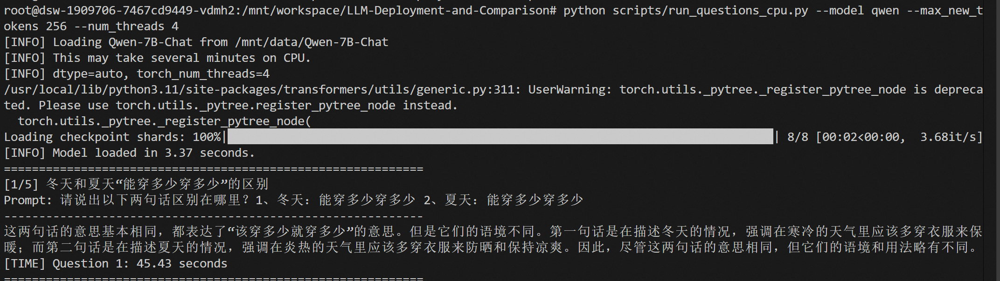

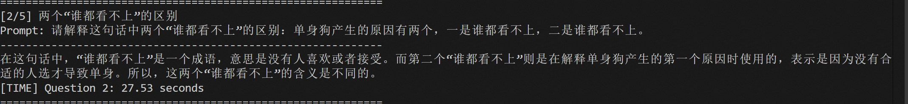

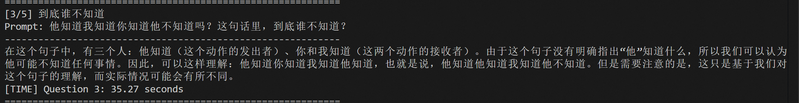

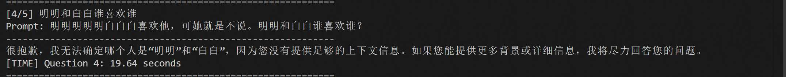

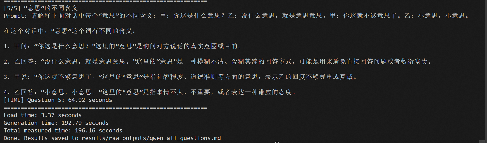

总体来看，Qwen 的中文表达比较自然，格式也较清楚，但在本组偏歧义、偏脑筋急转弯的问题上不够稳定。它对第五题的解释最好，能够较系统地列出“意思”的不同含义；但在第二题和第四题上没有抓住题目的关键语言现象，说明其对中文双关和非常规断句的鲁棒性仍有限。

### 5.2 ChatGLM3-6B

ChatGLM3-6B 的模型加载耗时为 0.86 秒，5 个问题生成总耗时为 3853.97 秒，运行总耗时为 3854.83 秒。它加载很快，但生成极慢，尤其是第二题和第五题都超过 1000 秒。该现象说明在 CPU 环境下，模型加载速度和文本生成速度并不一定一致，生成阶段才是主要耗时来源。

| 问题 | 生成耗时 | 回答表现概述 |
| --- | --- | --- |
| 问题 1 | 446.52 秒 | 能指出冬天多穿保暖，但夏天仍解释为“多穿散热”，没有准确理解夏天应尽量少穿。 |
| 问题 2 | 1169.42 秒 | 回答很长，但没有抓住“自己看不上别人/别人看不上自己”的核心双关，解释偏向“要求过高”和“挑剔”。 |
| 问题 3 | 805.07 秒 | 将问题解释成悖论，逻辑链条不够准确，没有直接回答谁不知道。 |
| 问题 4 | 397.53 秒 | 识别到句子模糊，但对“明明”和“白白”的关系判断摇摆，结论不稳定。 |
| 问题 5 | 1035.43 秒 | 能尝试解释不同“意思”，但部分角色和语义分配不够准确。 |

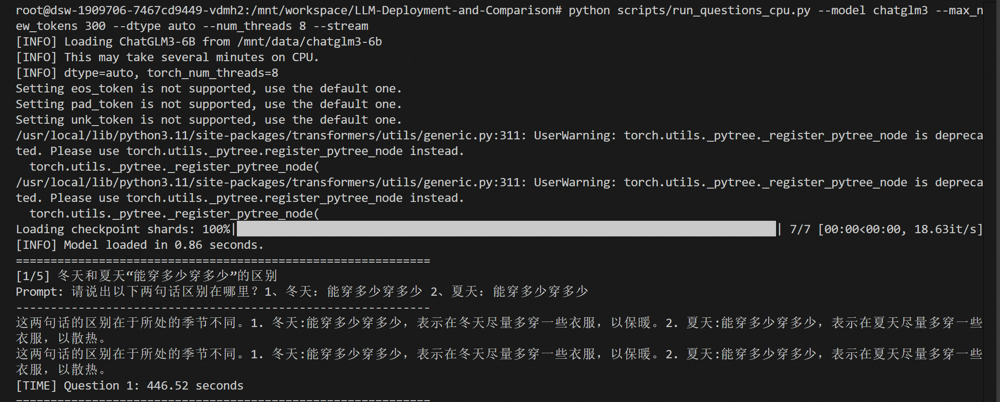

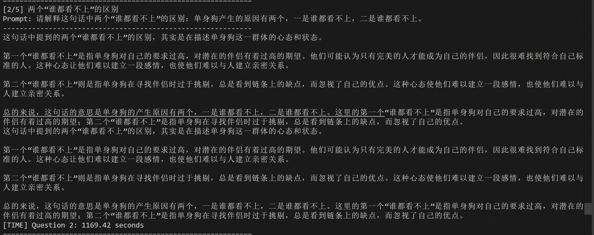

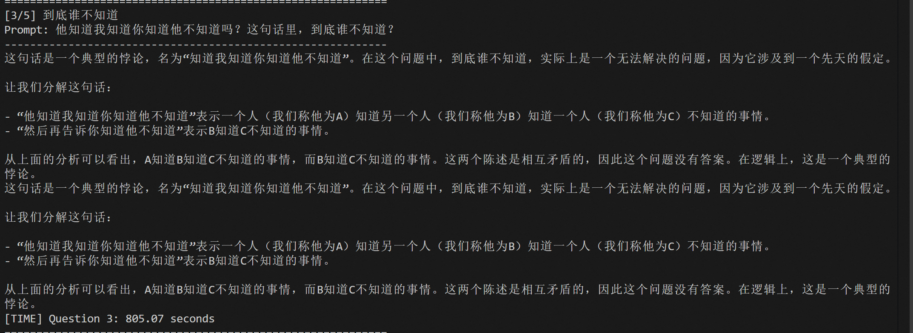

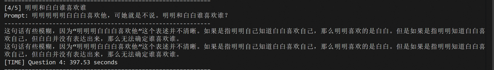

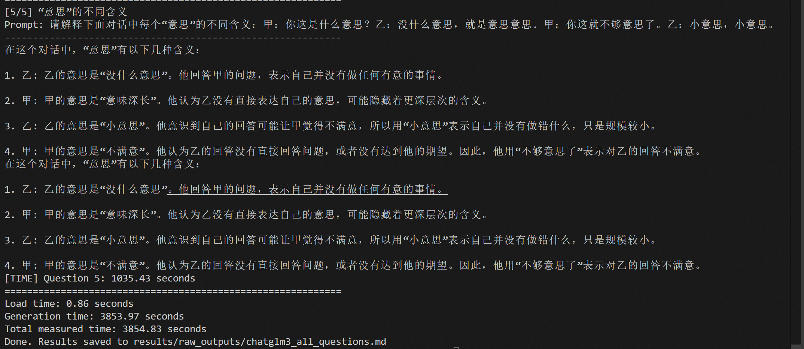

ChatGLM3 的回答风格偏解释型，常常会展开较长分析，但长回答没有必然带来更高准确率。第二题和第三题中，它给出了较多文字，却没有抓住题目真正考察的语言歧义和逻辑关系。在本次 CPU 环境中，ChatGLM3 的生成耗时远高于另外两个模型，因此从作业展示和实验效率角度看，它的运行成本较高。

### 5.3 Baichuan2-7B-Chat

Baichuan2-7B-Chat 的模型加载耗时为 100.20 秒，5 个问题生成总耗时为 200.43 秒，运行总耗时为 300.63 秒。它的加载时间明显长于 Qwen 和 ChatGLM3，但生成速度较快，整体耗时接近 Qwen，远低于 ChatGLM3。

| 问题 | 生成耗时 | 回答表现概述 |
| --- | --- | --- |
| 问题 1 | 23.41 秒 | 正确说明冬天多穿保暖、夏天少穿散热，是三者中对该题理解最准确的回答之一。 |
| 问题 2 | 88.46 秒 | 能区分两个“谁都看不上”有不同侧重点，但仍没有明确说出“自己看不上别人”和“别人看不上自己”这一标准解释。 |
| 问题 3 | 11.78 秒 | 直接回答“他不知道”，虽然解释较简略，但结论较接近题目核心。 |
| 问题 4 | 18.34 秒 | 将关系判断为“明明喜欢白白”，与更合理的断句解释不一致。 |
| 问题 5 | 58.44 秒 | 出现扩写和偏题，额外加入原问题没有出现的对话，导致解释准确性下降。 |

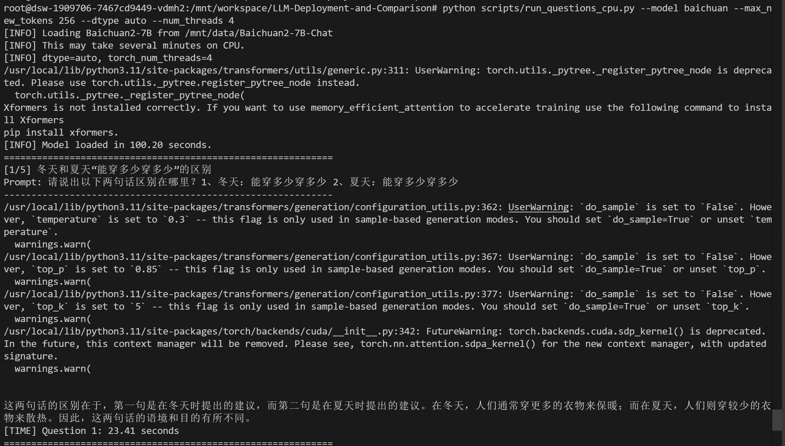

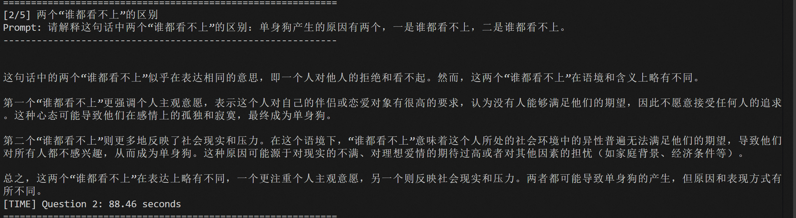

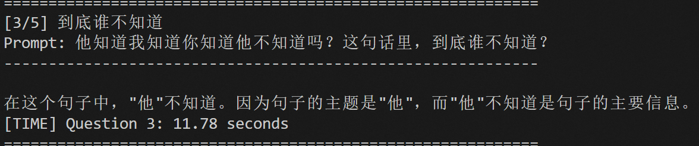

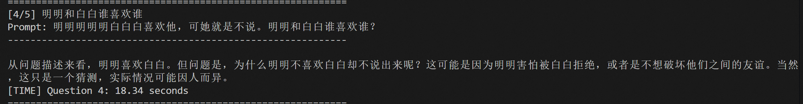

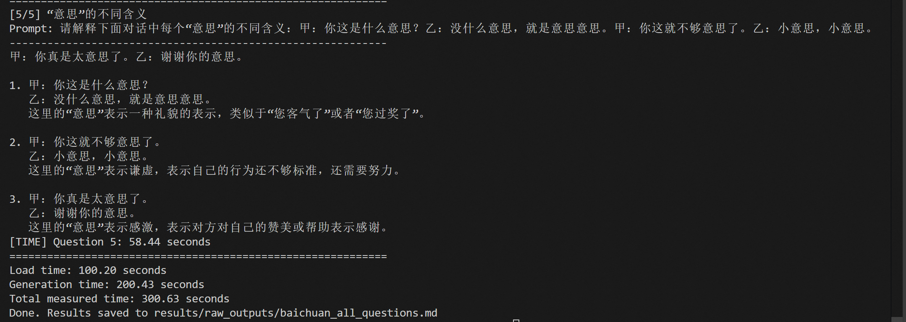

Baichuan 的优势在于回答速度较快，并且第一题和第三题的结论比较直接。但它在复杂语境中容易自行补充不存在的内容，第五题就是典型例子。对话中原本只有四句，它却额外生成“你真是太意思了”“谢谢你的意思”等内容，导致分析对象偏离原题。

## 6. 横向对比分析

从中文表达流畅度看，三个模型都能生成基本通顺的中文回答。Qwen 的回答相对简洁，ChatGLM3 更倾向于长篇解释，Baichuan 的回答也较自然，但有时会主动补充题目中没有出现的内容。单看文字流畅度，三者差距不算特别大；但一旦问题涉及歧义、特殊断句和多层逻辑，差异就比较明显。

在第一题“冬天和夏天能穿多少穿多少”中，Baichuan 的回答最接近预期，能够明确说明冬天多穿保暖、夏天少穿散热。Qwen 和 ChatGLM3 都能识别冬天应多穿，但对夏天的解释不够准确，仍然倾向于从“多穿”角度解释，没有完全抓住同一句话在不同季节中的反向语义。

在第二题“谁都看不上”中，三个模型都没有完全抓住标准双关。该题关键在于两个“谁都看不上”分别可以表示“自己看不上别人”和“别人看不上自己”。Qwen 将其解释为没有合适人选，ChatGLM3 解释为要求过高和挑剔，Baichuan 解释为个人主观意愿和社会现实压力。它们都意识到两处表达可能不同，但没有准确说明视角反转。

第三题考察多层“知道/不知道”的逻辑关系。Qwen 的回答逻辑链较混乱，ChatGLM3 将问题解释成悖论但没有直接解决，Baichuan 直接回答“他不知道”。Baichuan 的解释较简略，但结论更接近题目核心。

第四题是最考验断句和指代关系的题目。理想情况下，模型需要从“明明明明明白白白喜欢他，可她就是不说”中还原出“明明明明白，白白喜欢他，可她就是不说”这类可能断句。三个模型在该题上都没有给出完全准确的分析：Qwen 表示上下文不足，ChatGLM3 判断摇摆，Baichuan 则判断为明明喜欢白白。

第五题“一词多义”中，Qwen 表现最好，能够较系统地区分“意思”在意图、敷衍表示、够朋友或够诚意、小事情等语境中的不同含义。ChatGLM3 也能解释部分语义，但角色和含义对应不够准确。Baichuan 则额外生成了原题没有出现的新对话，导致分析对象偏离原问题。

综合来看，Qwen-7B-Chat 在本次 CPU Notebook 实验中整体最均衡，运行耗时较低，对一词多义问题的解释较好；Baichuan2-7B-Chat 在部分问题上回答直接，生成速度也较快，但容易偏题；ChatGLM3-6B 的文字表达完整，但 CPU 生成耗时过长，并且准确性没有明显优势。

更完整的结果表见 [results/comparison_table.md](results/comparison_table.md)。

## 7. 实验中遇到的问题与解决方法

实验过程中首先遇到的是依赖版本兼容问题。Qwen-7B-Chat 运行时曾出现 `cannot import name 'DisjunctiveConstraint' from 'transformers'` 的错误。该问题不是模型文件缺失，而是 `transformers_stream_generator` 与当前 `transformers` 版本不匹配。解决方法是在安装脚本中固定 `transformers==4.33.3`、`transformers_stream_generator==0.0.4` 和 `pydantic==1.10.13`，并通过 `bash scripts/install_deps_cpu.sh` 统一安装依赖。

第二个问题是 CPU 推理速度慢，并且在非流式输出时容易误以为程序卡死。模型加载完成后，终端会显示当前问题和 prompt，但如果使用普通 `model.chat()`，程序需要等完整回答生成完才一次性打印结果。此时模型实际正在逐 token 生成文本，只是终端没有中间输出。为了解决这个观察困难，脚本加入了 `--stream` 参数；Qwen 和 ChatGLM3 支持流式输出时，可以边生成边显示内容，从而更容易判断程序是在运行还是卡住。

第三个问题是模型加载和模型回答是两个不同阶段。实验中出现过 checkpoint shards 已经 100% 加载，但后面很久没有输出的情况。后来确认这通常表示模型已经加载完成，正在进行生成推理。7B 模型在 CPU 上每生成一个 token 都要执行一次较大的前向计算，因此即使 `max_new_tokens` 设置得较小，仍然可能等待较久。脚本因此记录了模型加载耗时、每题生成耗时和总耗时，便于在报告中区分“加载慢”和“生成慢”。

第四个问题是模型精度和线程数对 CPU 推理速度的影响不稳定。实验中尝试过 `dtype auto`、`bfloat16`、不同 `num_threads` 设置。低精度在 GPU 上通常能加速，但在 CPU 上是否更快取决于硬件是否支持相关指令；如果硬件不支持，`bfloat16` 或 `float16` 反而可能更慢。因此最终主要采用 `--dtype auto`，并根据模型分别设置 `--num_threads 4` 或 `--num_threads 8`。

第五个问题是云平台磁盘空间有限，无法同时保存三个模型。解决方法是将 `scripts/download_models.sh` 改为按单模型下载，支持 `qwen`、`chatglm3` 和 `baichuan` 参数。实验时先下载并测试一个模型，保存结果和截图后，再删除该模型目录，继续下载下一个模型。

第六个问题是不同模型的 warning 容易造成误判。例如 ChatGLM3 运行时出现过 `do_sample`、`temperature`、`top_p` 相关提示，Baichuan 运行时出现过 `xformers` 未安装提示。这些提示并不一定是错误。ChatGLM3 的生成参数后来做了调整，Baichuan 的 `xformers` 提示主要面向 GPU 加速，本实验为 CPU 推理，因此没有额外安装 `xformers`。

## 8. 结论

本实验说明，开源大语言模型即使参数规模接近，在中文理解和 CPU 推理效率上也会表现出明显差异。Qwen-7B-Chat 更适合作为本次作业的主要展示模型，Baichuan2-7B-Chat 可作为回答风格和速度对照，ChatGLM3-6B 虽然能够完成测试，但在 CPU Notebook 中生成效率较低。对于真实应用场景，如果需要更快、更稳定的大模型推理，仍然更适合使用 GPU 环境或更小规模的模型。
