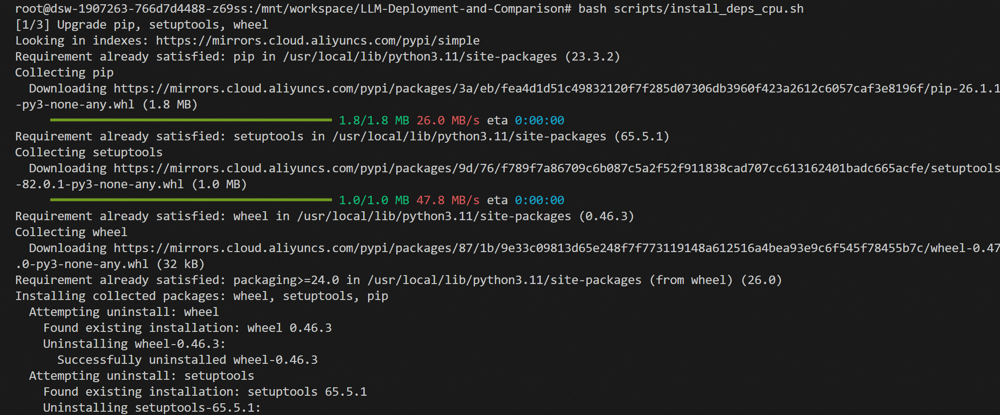

# ModelScope 开源大语言模型部署与横向对比实验报告

姓名：蒋昊沄  
学号：2450333  
课程：人工智能导论  
GitHub 项目链接：[https://github.com/JambitX11/LLM-Deployment-and-Comparison](https://github.com/JambitX11/LLM-Deployment-and-Comparison)

## 1. 实验目的

本次实验围绕 ModelScope/魔搭平台上的开源大语言模型部署与测试展开。实验目标是在云端 Notebook 环境中完成模型仓库下载、Python 依赖安装和命令行推理，并使用同一组中文测试问题比较不同模型在中文表达、语义歧义理解、多层逻辑推理、指代关系理解以及一词多义理解方面的表现。通过横向对比，可以更直观地观察不同开源大语言模型在相同任务下的能力差异和运行代价。

本实验不将模型权重文件提交到 GitHub。GitHub 仓库只保存代码、测试问题、运行脚本、原始输出、截图和报告，模型权重在 ModelScope 云平台中下载到 `/mnt/data/`，代码运行目录为 `/mnt/workspace/LLM-Deployment-and-Comparison`。

## 2. 实验平台与环境

实验在 ModelScope/魔搭平台的 CPU Notebook 环境中完成。项目代码通过 GitHub 克隆到 `/mnt/workspace/LLM-Deployment-and-Comparison`，模型文件下载到 `/mnt/data/`。由于云平台磁盘空间有限，三个模型没有同时保存在 `/mnt/data/` 中，而是采用“下载一个模型、测试一个模型、保存结果和截图、必要时删除后再下载下一个模型”的方式完成实验。


项目仓库克隆过程如下图所示。克隆完成后，后续安装依赖、下载模型和运行测试脚本都在该项目目录下完成。


依赖安装通过仓库中的 `scripts/install_deps_cpu.sh` 完成。该脚本安装 CPU 版本 PyTorch，并安装 `transformers`、`modelscope`、`sentencepiece`、`accelerate` 等推理所需依赖。实验过程中曾遇到 Qwen 相关依赖版本兼容问题，因此最终在脚本中固定了 `transformers==4.33.3` 和 `transformers_stream_generator==0.0.4`。




## 3. 模型选择

本实验选择了三个中文开源大语言模型：Qwen-7B-Chat、ChatGLM3-6B 和 Baichuan2-7B-Chat。它们都属于中文场景中较常见的开源对话模型，参数规模接近，适合在同一组测试问题上进行横向比较。

| 模型 | 本地模型目录 | 推理脚本 | 说明 |
| --- | --- | --- | --- |
| Qwen-7B-Chat | `/mnt/data/Qwen-7B-Chat` | `scripts/run_qwen_cpu.py` | 中文能力较强，支持 `chat` / `chat_stream` 接口。 |
| ChatGLM3-6B | `/mnt/data/chatglm3-6b` | `scripts/run_chatglm3_cpu.py` | 典型中文对话模型，模型加载较快，但本次 CPU 生成耗时较长。 |
| Baichuan2-7B-Chat | `/mnt/data/Baichuan2-7B-Chat` | `scripts/run_baichuan_cpu.py` | 中文开源对话模型，输出速度较快，但部分问题存在偏题。 |

模型下载截图如下。


## 4. 实验方法

测试问题保存在 `prompts/test_questions.json` 中，人工阅读版说明保存在 `prompts/test_questions.md` 中。为了避免 CPU 环境下重复加载模型造成额外耗时，实验使用 `scripts/run_questions_cpu.py` 对单个模型进行批量测试。脚本每次只加载一个模型，然后按顺序运行 5 个测试问题，并将输出写入 `results/raw_outputs/` 下的 Markdown 文件。

三个模型的主要运行命令如下：

```bash
python scripts/run_questions_cpu.py --model qwen --max_new_tokens 256 --dtype auto --num_threads 4
python scripts/run_questions_cpu.py --model chatglm3 --max_new_tokens 256 --dtype auto --num_threads 4
python scripts/run_questions_cpu.py --model baichuan --max_new_tokens 256 --dtype auto --num_threads 4
```

实验问题覆盖五类中文能力。第一题考察模型能否理解同一句话在冬天和夏天的相反语境；第二题考察“谁都看不上”的双向歧义；第三题考察“知道/不知道”的多层逻辑；第四题考察“明明、白白、他、她”的断句和指代关系；第五题考察“意思”一词在不同语境中的多义解释。

## 5. 问答测试结果

### 5.1 Qwen-7B-Chat

Qwen-7B-Chat 的模型加载耗时为 3.37 秒，5 个问题生成总耗时为 192.79 秒，运行总耗时为 196.16 秒。从耗时看，Qwen 在本次 CPU 环境下运行相对顺利，五个问题中耗时最长的是“一词多义”问题，生成耗时为 64.92 秒。

| 问题 | 生成耗时 | 回答表现概述 |
| --- | --- | --- |
| 问题 1 | 45.43 秒 | 能识别冬天应多穿，但对夏天解释为“多穿防晒和保持凉爽”，没有准确说出夏天语境中“能穿多少穿多少”常指尽量少穿。 |
| 问题 2 | 27.53 秒 | 没有准确抓住两个“谁都看不上”分别表示“自己看不上别人”和“别人看不上自己”的幽默歧义。 |
| 问题 3 | 35.27 秒 | 对多层“知道/不知道”关系解释混乱，没有给出稳定明确的逻辑结论。 |
| 问题 4 | 19.64 秒 | 没能完成断句和指代解析，回答为上下文不足。 |
| 问题 5 | 64.92 秒 | 对“意思”的多义解释较完整，能区分意图、敷衍、够朋友和小事等含义。 |


总体来看，Qwen 的中文表达比较自然，格式也较清楚，但在本组偏歧义、偏脑筋急转弯的问题上不够稳定。它对第五题的解释最好，能够较系统地列出“意思”的不同含义；但在第二题和第四题上没有抓住题目的关键语言现象，说明其对中文双关和非常规断句的鲁棒性仍有限。

### 5.2 ChatGLM3-6B

ChatGLM3-6B 的模型加载耗时为 0.86 秒，5 个问题生成总耗时为 3853.97 秒，运行总耗时为 3854.83 秒。它加载很快，但生成极慢，尤其是第二题和第五题都超过 1000 秒。该现象说明在 CPU 环境下，模型加载速度和文本生成速度并不一定一致，生成阶段才是主要耗时来源。

| 问题 | 生成耗时 | 回答表现概述 |
| --- | --- | --- |
| 问题 1 | 446.52 秒 | 能指出冬天多穿保暖，但夏天仍解释为“多穿散热”，没有准确理解夏天应尽量少穿。 |
| 问题 2 | 1169.42 秒 | 回答很长，但没有抓住“自己看不上别人/别人看不上自己”的核心双关，解释偏向“要求过高”和“挑剔”。 |
| 问题 3 | 805.07 秒 | 将问题解释成悖论，逻辑链条不够准确，没有直接回答谁不知道。 |
| 问题 4 | 397.53 秒 | 识别到句子模糊，但对“明明”和“白白”的关系判断摇摆，结论不稳定。 |
| 问题 5 | 1035.43 秒 | 能尝试解释不同“意思”，但部分角色和语义分配不够准确。 |


ChatGLM3 的回答风格偏解释型，常常会展开较长分析，但长回答没有必然带来更高准确率。第二题和第三题中，它给出了较多文字，却没有抓住题目真正考察的语言歧义和逻辑关系。在本次 CPU 环境中，ChatGLM3 的生成耗时远高于另外两个模型，因此从作业展示和实验效率角度看，它的运行成本较高。

### 5.3 Baichuan2-7B-Chat

Baichuan2-7B-Chat 的模型加载耗时为 100.20 秒，5 个问题生成总耗时为 200.43 秒，运行总耗时为 300.63 秒。它的加载时间明显长于 Qwen 和 ChatGLM3，但生成速度较快，整体耗时接近 Qwen，远低于 ChatGLM3。

| 问题 | 生成耗时 | 回答表现概述 |
| --- | --- | --- |
| 问题 1 | 23.41 秒 | 正确说明冬天多穿保暖、夏天少穿散热，是三者中对该题理解最准确的回答之一。 |
| 问题 2 | 88.46 秒 | 能区分两个“谁都看不上”有不同侧重点，但仍没有明确说出“自己看不上别人”和“别人看不上自己”这一标准解释。 |
| 问题 3 | 11.78 秒 | 直接回答“他不知道”，虽然解释较简略，但结论较接近题目核心。 |
| 问题 4 | 18.34 秒 | 将关系判断为“明明喜欢白白”，与更合理的断句解释不一致。 |
| 问题 5 | 58.44 秒 | 出现扩写和偏题，额外加入原问题没有出现的对话，导致解释准确性下降。 |


Baichuan 的优势在于回答速度较快，并且第一题和第三题的结论比较直接。但它在复杂语境中容易自行补充不存在的内容，第五题就是典型例子。对话中原本只有四句，它却额外生成“你真是太意思了”“谢谢你的意思”等内容，导致分析对象偏离原题。

## 6. 横向对比分析

| 对比维度 | Qwen-7B-Chat | ChatGLM3-6B | Baichuan2-7B-Chat |
| --- | --- | --- | --- |
| 中文表达流畅度 | 表达自然，条理清楚 | 表达完整但偏冗长 | 表达较流畅，但偶有偏题扩写 |
| 语义歧义理解 | 对双关题表现较弱 | 长篇解释但未抓住核心双关 | 能意识到含义不同，但解释不够精准 |
| 多层逻辑推理 | 逻辑链混乱 | 将问题解释为悖论，未直接解决 | 结论直接，但解释较简略 |
| 指代关系理解 | 未能完成断句 | 判断摇摆，结论不清 | 给出结论但方向错误 |
| 一词多义理解 | 表现最好，解释较全面 | 能解释部分含义但角色分配不准 | 出现额外扩写，偏离原对话 |
| 回答稳定性 | 中等，部分题目拒答或误解 | 较弱，耗时长且准确率不高 | 中等，速度快但有偏题风险 |
| 运行效率 | 加载快，生成较快 | 加载快，生成极慢 | 加载慢，生成较快 |

从语言表达看，Qwen 和 ChatGLM3 都能生成比较完整的中文解释，Baichuan 的回答也通顺，但更容易偏离原题。若只看自然语言流畅度，三个模型都能达到基本可读水平；但本实验的问题并不只考察流畅度，更关注模型能否准确理解中文中的歧义和特殊句式。

在语义歧义理解方面，三个模型都没有完全答出第二题的标准双关解释。题目中的两个“谁都看不上”分别可以理解为“自己看不上别人”和“别人看不上自己”，这是中文幽默表达中的视角反转。Qwen 将其解释为“没有合适的人选”，ChatGLM3 解释为“要求过高”和“过于挑剔”，Baichuan 则解释为个人主观意愿和社会现实压力。它们都能感知两处表达可能不同，但没有准确抓住最核心的双向关系。

在多层逻辑推理方面，Baichuan 的回答最直接，指出“他不知道”；Qwen 和 ChatGLM3 都出现了较明显的逻辑混乱。Qwen 的回答中多次改变“知道”的对象，最后没有形成清楚结论。ChatGLM3 把问题解释为悖论，但题目更像嵌套认知关系解析，不一定需要上升为悖论。因此，该题反映出模型对嵌套逻辑的处理仍然容易受自然语言表面结构干扰。

在指代关系理解方面，三个模型表现都不理想。第四题需要先断句，再判断“白白喜欢他，可她就是不说”中的“她”更可能指白白。Qwen 直接表示上下文不足，ChatGLM3 的结论不稳定，Baichuan 则判断为明明喜欢白白。该题说明，当中文句子刻意去掉标点并重复使用相同汉字时，模型很容易无法正确还原句法结构。

在一词多义理解方面，Qwen 的表现最好，能够较准确地区分“意图”“敷衍表示”“不够朋友或不够诚意”“事情不大”等含义。ChatGLM3 也能解释部分含义，但对对话角色和具体语境的对应不够准确。Baichuan 则额外生成了原题没有出现的新对话，导致分析对象发生偏移。综合来看，一词多义题中 Qwen 的解释最贴近题目。

从运行效率看，Qwen 的综合体验最好，加载和生成都比较稳定。Baichuan 的加载耗时较长，但生成阶段较快，总体仍可接受。ChatGLM3 虽然加载最快，但生成阶段极慢，5 题总生成耗时超过 3800 秒，在 CPU Notebook 中使用成本最高。

## 7. 实验中遇到的问题与解决方法

实验过程中最主要的问题是 CPU 环境下 7B 级模型推理速度不稳定。模型加载和文本生成是两个不同阶段，加载完成并不代表马上能看到回答；生成阶段需要模型逐 token 计算，CPU 环境下可能等待较久。实验中曾出现 checkpoint shards 已经加载到 100%，但终端在显示问题和 prompt 后长时间没有新输出的情况。后来确认这通常不是程序停止，而是模型正在生成答案。为减少重复加载耗时，最终使用 `run_questions_cpu.py` 让单个模型只加载一次，然后连续回答 5 个问题。

第二个问题是非流式输出容易造成“卡死”的错觉。普通 `model.chat()` 往往需要等完整回答生成完才返回，终端中间不会显示 token。为了更清楚地观察程序是否仍在运行，脚本加入了 `--stream` 参数。对于支持流式接口的模型，例如 Qwen 和 ChatGLM3，使用流式打印可以边生成边显示内容，比等待完整回答更直观，也更适合在截图和调试时确认程序状态。

第三个问题是依赖版本兼容。Qwen 运行时曾出现 `cannot import name 'DisjunctiveConstraint' from 'transformers'` 的错误，原因是 `transformers_stream_generator` 与当前 `transformers` 版本不兼容。解决方法是在安装脚本中固定 `transformers==4.33.3` 和 `transformers_stream_generator==0.0.4`，并通过 `scripts/install_deps_cpu.sh` 统一安装依赖。

第四个问题是模型精度和 CPU 性能之间的关系并不简单。实验中尝试过 `dtype auto`、`bfloat16` 和线程数设置。低精度在 GPU 上通常有加速效果，但在 CPU 上是否更快取决于硬件支持。如果 CPU 不支持相关低精度指令，`bfloat16` 或 `float16` 可能并不会加速，甚至会更慢。因此最终以能稳定运行的 `dtype auto` 为主要设置，并通过脚本记录加载耗时、每题生成耗时和总耗时。

第五个问题是云平台磁盘空间有限。三个模型都属于 6B 到 7B 级别，模型文件较大，无法稳定地同时保存在 `/mnt/data/` 中。解决方法是将模型下载脚本改成单模型下载方式：先下载并测试 Qwen，保存结果和截图后删除；再下载并测试 ChatGLM3；最后下载并测试 Baichuan。这样可以避免磁盘空间不足导致模型下载失败。

第六个问题是模型运行时会出现一些 warning，容易被误认为报错。例如 ChatGLM3 曾提示 `do_sample` 与 `temperature/top_p` 参数组合不一致，Baichuan 曾提示未正确安装 `xformers`。经过检查，这些并不等同于模型运行失败。ChatGLM3 的生成参数后来进行了调整；Baichuan 的 `xformers` 主要用于 GPU 加速，本实验在 CPU 环境下运行，因此没有额外安装该依赖。

## 8. 总结

本次实验完成了在 ModelScope 平台上部署并测试 Qwen-7B-Chat、ChatGLM3-6B 和 Baichuan2-7B-Chat 三个开源大语言模型的过程，并基于统一中文问题进行了横向比较。实验结果表明，三个模型都能进行基本中文问答，但在中文歧义、特殊断句、多层逻辑和指代关系问题上仍存在明显差异。

综合回答质量和运行效率看，Qwen-7B-Chat 在本次实验中整体表现较均衡。它的生成速度较快，一词多义解释较准确，但在歧义和指代题上仍会出错。Baichuan2-7B-Chat 的速度也较好，部分问题回答直接，但存在偏题和自行扩写现象。ChatGLM3-6B 的表达较完整，但 CPU 生成耗时过长，并且准确性没有明显优势。

因此，本实验的结论是：在当前 CPU Notebook 条件下，Qwen-7B-Chat 更适合作为作业展示模型；Baichuan2-7B-Chat 可以作为速度和回答风格的对照；ChatGLM3-6B 虽然能够运行，但在 CPU 环境中的生成效率较低。对于真实应用，如果希望获得更稳定和更快的大模型推理体验，仍然更适合使用 GPU 环境或更小规模的模型。
